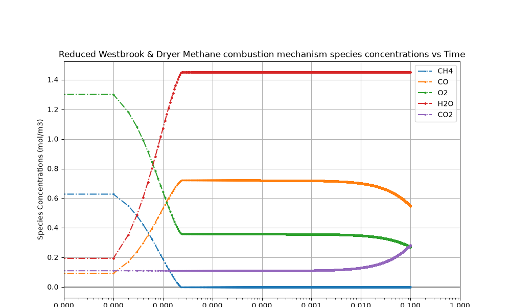

# RK4 Numerical Solver for Chemical Kinetics ODEs

## Overview
A Python-based numerical solver using the 4th-order Runge-Kutta (RK4) method 
to integrate systems of ordinary differential equations governing chemical 
kinetics. Applied to the Westbrook-Dryer reduced mechanism for methane 
combustion, with a modular structure allowing custom ODE systems to be 
defined and solved using the same RK4 engine.

*Note: Core implementation is private. This repository showcases the 
methodology and results.*

## Method
- 4th-order Runge-Kutta (RK4) integration scheme
- Applied to the Westbrook-Dryer reduced mechanism for methane combustion
- Modular design supporting custom ODE system definitions

## Results

## Skills
Python · Numerical Methods · Chemical Kinetics · Combustion Modeling · Scientific Computing
